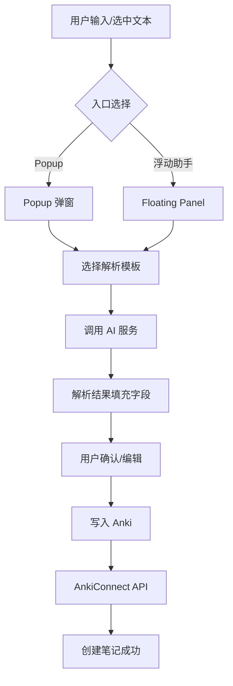

# AnkiBeam (dev 分支) 代码审查报告

**审查日期**: 2026-01-03  
**审查分支**: `dev`  
**审查者**: Claude (AI Assistant)

---

## 一、项目概述

### 1.1 项目简介

这是一个 Chrome 扩展程序，使用 AI 技术帮助用户快速创建 Anki 单词卡片。支持多种 AI 服务商（Google Gemini、OpenAI GPT、Anthropic Claude），提供自定义解析模板功能。

### 1.2 技术栈

- **平台**: Chrome Extension Manifest V3
- **语言**: ES6 Modules (原生 JavaScript)
- **样式**: Tailwind CSS
- **依赖**:
  - `jsdom` (测试用)
  - `tailwindcss` (样式构建)
  - `undici` (Node.js HTTP 客户端)

### 1.3 项目结构

```
ankibeam/
├── background/          # 后台服务脚本 (Service Worker)
├── content/             # 内容脚本（浮动助手）
├── popup/               # 弹窗界面
├── options/             # 设置页面
├── services/            # 业务服务层
├── utils/               # 工具模块
├── _locales/            # 多语言资源
├── icons/               # 图标资源
├── styles/              # CSS 样式
└── docs/                # 文档
```

---

## 二、业务流程分析

### 2.1 核心业务流程



### 2.2 模块职责划分

| 模块          | 职责                             | 关键文件                                      |
| ------------- | -------------------------------- | --------------------------------------------- |
| **配置管理**  | 配置的加载、保存、迁移、加密     | `config-service.js`, `storage.js`             |
| **AI 服务**   | 多服务商调用、重试机制、健康检查 | `ai-service.js`, `providers.config.js`        |
| **模板管理**  | 解析模板的 CRUD、激活、默认设置  | `template-store.js`                           |
| **Anki 交互** | 笔记创建、字段映射、样式包装     | `anki-service.js`, `ankiconnect.js`           |
| **UI 层**     | 用户交互、状态显示、错误处理     | `popup.js`, `floating-panel.js`, `options.js` |
| **国际化**    | 多语言支持                       | `i18n.js`, `_locales/`                        |

---

## 三、代码质量评估

### 3.1 总体评分

| 维度         | 评分 (满分 5) | 说明                         |
| ------------ | ------------- | ---------------------------- |
| **代码结构** | ⭐⭐⭐⭐      | 模块化设计合理，职责划分清晰 |
| **可读性**   | ⭐⭐⭐⭐      | JSDoc 注释完整，命名规范     |
| **可维护性** | ⭐⭐⭐        | 部分代码需要重构优化         |
| **错误处理** | ⭐⭐⭐⭐      | 有完善的错误边界机制         |
| **性能**     | ⭐⭐⭐        | 存在一些可优化的点           |
| **安全性**   | ⭐⭐⭐⭐      | API Key 加密存储             |

### 3.2 优点总结

#### ✅ 架构设计

1. **服务层抽象**: `config-service.js` 和 `anki-service.js` 提供了良好的业务逻辑封装
2. **模块化**: ES6 Modules 实现了清晰的模块划分
3. **配置驱动**: 提供商配置 (`providers.config.js`) 可扩展性好

#### ✅ 错误处理

1. **ErrorBoundary 类**: 统一的错误处理入口，支持重试机制
2. **用户友好的错误消息**: 根据上下文生成本地化的错误提示
3. **频繁错误保护**: 防止短时间内大量错误导致系统不稳定

#### ✅ 国际化支持

1. **完整的 i18n 实现**: 支持 4 种语言
2. **占位符替换**: 支持动态参数的国际化消息

#### ✅ 安全考量

1. **API Key 加密**: 使用 AES-GCM 算法加密存储
2. **每个提供商独立的加密盐值**: 增加安全性
3. **权限管理**: 动态请求自定义 API 端点的权限

---

## 四、问题识别与改进建议

### 4.1 🔴 高优先级问题

#### 问题 1: `options.js` 文件过大

**位置**: `options/options.js` (3428 行, 99KB)

**问题描述**:
单文件承载了太多职责，包括：

- AI 提供商配置 UI
- Anki 连接配置
- 模板编辑器
- 样式配置
- 语言设置

**影响**:

- 难以维护和测试
- 加载性能问题
- 代码复用困难

**建议修改**:

```javascript
// 建议拆分为多个模块
// options/modules/ai-provider-config.js
// options/modules/template-editor.js
// options/modules/anki-config.js
// options/modules/style-config.js

// options/options.js - 主入口，负责协调各模块
import { initAIProviderConfig } from "./modules/ai-provider-config.js";
import { initTemplateEditor } from "./modules/template-editor.js";
import { initAnkiConfig } from "./modules/anki-config.js";

async function initialize() {
	await initAIProviderConfig();
	await initTemplateEditor();
	await initAnkiConfig();
}
```

---

#### 问题 2: `floating-panel.js` 文件过大

**位置**: `content/floating-panel.js` (1759 行, 47KB)

**问题描述**:
包含了大量的内联 CSS 样式定义（约 360 行），以及 UI 创建、状态管理、事件处理等逻辑。

**建议修改**:

1. 将 CSS 样式提取到独立文件
2. 将 UI 创建逻辑与业务逻辑分离

```javascript
// 建议结构
// content/floating-panel/
// ├── styles.js          // CSS 样式定义
// ├── dom-builder.js     // DOM 创建函数
// ├── state-machine.js   // 状态管理
// └── index.js           // 主控制器
```

---

#### 问题 3: 重复的 `normalizeConfig` 逻辑

**位置**: `content/content-main.js` 和 `utils/storage.js`

**问题描述**:
`content-main.js` 中有一个本地的 `normalizeConfig` 函数（行 701-774），与 `storage.js` 中的配置规范化逻辑存在重复。

**当前代码** (`content-main.js` 行 701-774):

```javascript
function normalizeConfig(rawConfig) {
	const defaults = {
		ui: { enableFloatingAssistant: true, fieldDisplayMode: "auto" },
		ankiConfig: {
			/* ... */
		},
		// ...
	};
	// 规范化逻辑...
}
```

**建议修改**:
应该复用 `storage.js` 中的配置处理逻辑，或者将通用的配置规范化函数提取到一个共享模块中。

```javascript
// utils/config-normalizer.js (新建)
export function normalizeUserConfig(rawConfig) {
	// 统一的规范化逻辑
}

// 在 content-main.js 中使用
import { normalizeUserConfig } from "../utils/config-normalizer.js";
```

---

### 4.2 🟡 中优先级问题

#### 问题 4: `readStoredConfig` 函数未被使用

**位置**: `content/content-main.js` 行 640-680

**问题描述**:
`readStoredConfig` 函数定义了但从未被调用。在 bootstrap 中已经通过 `configService.get()` 获取配置。

**当前代码**:

```javascript
async function readStoredConfig() {
	if (!chrome?.storage?.local?.get) {
		return null;
	}
	// ... 复杂的存储读取逻辑
}
```

**建议**: 删除这段死代码，或者如果需要保留作为后备，添加相应的注释说明。

---

#### 问题 5: 存储读写的双重处理

**位置**: `utils/storage.js`

**问题描述**:
`readFromStorage` 和 `writeToStorage` 函数同时支持 Promise API 和回调 API，逻辑较为复杂，增加了维护成本。

**当前代码** (`storage.js` 行 738-768):

```javascript
async function readFromStorage(key) {
	// 检查是否支持 Promise API（Chrome 新版本）
	if (chrome.storage.local.get.length <= 1) {
		const result = getter(key);
		if (result && typeof result.then === "function") {
			return result;
		}
	}
	// 使用回调 API（Chrome 旧版本）
	return new Promise(/*...*/);
}
```

**建议**:
考虑到 Manifest V3 已经要求 Chrome 88+，可以简化为只使用 Promise API：

```javascript
async function readFromStorage(key) {
	if (!chrome?.storage?.local?.get) {
		return {};
	}
	return chrome.storage.local.get(key);
}
```

---

#### 问题 6: 重复的 AI 调用函数

**位置**: `utils/ai-service.js` 行 887-912

**问题描述**:
`parseTextWithDynamicFields` 和 `parseTextWithDynamicFieldsFallback` 是完全相同的函数：

```javascript
export async function parseTextWithDynamicFields(/*...*/) {
	return runDynamicParsing(inputText, fieldNames, customTemplate, maxRetries);
}

export async function parseTextWithDynamicFieldsFallback(/*...*/) {
	return runDynamicParsing(inputText, fieldNames, customTemplate, maxRetries);
}
```

**建议**:
保留一个函数，另一个作为别名导出：

```javascript
export async function parseTextWithDynamicFields(/*...*/) {
	return runDynamicParsing(inputText, fieldNames, customTemplate, maxRetries);
}

// 保持向后兼容
export { parseTextWithDynamicFields as parseTextWithDynamicFieldsFallback };
```

---

#### 问题 7: AnkiConnect URL 硬编码

**位置**:

- `utils/ankiconnect.js` 行 4
- `background/background.js` 行 6

**问题描述**:
AnkiConnect URL 在两个地方都是硬编码的：

```javascript
const ANKI_CONNECT_URL = "http://127.0.0.1:8765";
```

**建议**:

1. 将 URL 提取为可配置项
2. 或者至少统一到一个常量模块中

```javascript
// utils/constants.js
export const ANKI_CONNECT_DEFAULT_URL = "http://127.0.0.1:8765";
export const ANKI_CONNECT_VERSION = 6;
```

---

#### 问题 8: 魔法数字

**位置**: 多处

**问题描述**:
代码中存在多处魔法数字，例如：

```javascript
// content/floating-panel.js
const PANEL_WIDTH = 360;
const PANEL_MAX_HEIGHT = 500;
const PANEL_GAP = 12;

// utils/error-boundary.js
this.maxErrors = 5;
this.resetInterval = 30000;

// utils/ai-service.js
const temperature =
	attempt === 1 ? 0.3 : Math.max(0.1, 0.3 - 0.1 * (attempt - 1));
```

**建议**:
虽然有些常量已经定义，但建议：

1. 将所有配置相关的常量集中管理
2. 对于像 temperature 这样的 AI 参数，考虑提取为配置项

---

### 4.3 🟢 低优先级问题

#### 问题 9: 混合语言注释

**位置**: 多个文件

**问题描述**:
代码注释混合使用中文、日语和英语，例如：

```javascript
// template-store.js - 日语注释
/**
 * テンプレートストア管理モジュール
 */

// content-main.js - 中文注释
/**
 * 启动函数 (IIFE - 立即调用函数表达式)
 */

// config-service.js - 英语和中文混合
// Subscribe to config changes via ConfigService
configService.subscribe((newConfig) => {
    logInfo("配置变更通知已接收，重新加载控制器配置");
```

**建议**:
统一使用一种语言进行注释。考虑到国际化的需求，建议：

- 代码注释统一使用英文
- JSDoc 文档标准化

---

#### 问题 10: 潜在的内存泄漏

**位置**: `content/floating-panel.js`

**问题描述**:
创建的事件监听器在 `destroy()` 方法中需要确保全部清理：

```javascript
// 需要确保以下监听器在 destroy 时被移除
templateSelect.addEventListener("change", async (e) => {
	/*...*/
});
pinButton.addEventListener("click", togglePin);
closeButton.addEventListener("click", () => {
	/*...*/
});
retryButton.addEventListener("click", () => {
	/*...*/
});
writeButton.addEventListener("click", () => {
	/*...*/
});
shadowRoot.addEventListener("keydown", handleKeyDown, true);
panel.addEventListener("mousedown", handlePanelMouseDown);
```

**建议**:

1. 在创建监听器时保存引用
2. 在 `destroy()` 方法中移除所有监听器

---

#### 问题 11: popup.js 变量声明

**位置**: `popup/popup.js` 行 543

**问题描述**:
使用了未声明的变量 `result`：

```javascript
result = await parseTextWithDynamicFieldsFallback(
	selectedText,
	dynamicFields,
	customPrompt,
);
```

这应该是 `const result = ...` 或者检查是否有前置的声明。

**建议**:
添加变量声明以避免隐式全局变量。

---

#### 问题 12: 缺少类型定义

**位置**: 全项目

**问题描述**:
项目使用纯 JavaScript，缺少 TypeScript 或 JSDoc 类型定义，这可能导致：

- IDE 自动补全不完善
- 重构时难以发现类型错误

**建议**:

1. 短期：完善 JSDoc 类型注释
2. 长期：考虑迁移到 TypeScript

```javascript
/**
 * @typedef {Object} TemplateField
 * @property {string} name - 字段名称
 * @property {string} label - 显示标签
 * @property {string} parseInstruction - 解析指令
 * @property {number} order - 排序顺序
 * @property {boolean} isRequired - 是否必填
 * @property {'auto'|'manual'} aiStrategy - AI 策略
 */

/**
 * @typedef {Object} Template
 * @property {string} id - 模板 ID
 * @property {string} name - 模板名称
 * @property {TemplateField[]} fields - 字段列表
 */
```

---

## 五、架构改进建议

### 5.1 建议引入状态管理

当前各模块的状态分散管理，建议引入轻量级的状态管理模式：

```javascript
// utils/state-store.js
class StateStore {
	constructor(initialState = {}) {
		this.state = initialState;
		this.listeners = new Set();
	}

	getState() {
		return { ...this.state };
	}

	setState(updates) {
		this.state = { ...this.state, ...updates };
		this.notify();
	}

	subscribe(listener) {
		this.listeners.add(listener);
		return () => this.listeners.delete(listener);
	}

	notify() {
		this.listeners.forEach((listener) => listener(this.state));
	}
}

export const appState = new StateStore({
	config: null,
	activeTemplate: null,
	parseResult: null,
	uiState: "idle",
});
```

### 5.2 建议的目录结构调整

```
ankibeam/
├── src/
│   ├── background/
│   │   └── index.js
│   ├── content/
│   │   ├── components/
│   │   │   ├── floating-button/
│   │   │   └── floating-panel/
│   │   └── index.js
│   ├── popup/
│   │   ├── components/
│   │   └── index.js
│   ├── options/
│   │   ├── modules/
│   │   │   ├── ai-provider/
│   │   │   ├── template-editor/
│   │   │   └── anki-config/
│   │   └── index.js
│   ├── services/
│   │   ├── config-service.js
│   │   ├── anki-service.js
│   │   └── ai-service.js
│   ├── utils/
│   │   ├── storage.js
│   │   ├── i18n.js
│   │   └── ...
│   └── shared/
│       ├── constants.js
│       ├── types.js (JSDoc 类型定义)
│       └── error-boundary.js
├── test/
└── dist/ (构建输出)
```

### 5.3 测试覆盖率建议

目前只发现一个测试文件 `template-store.test.js`。建议增加以下测试：

1. **单元测试**:

   - `storage.js` - 配置加载/保存/迁移
   - `ai-service.js` - API 调用、重试逻辑
   - `prompt-engine.js` - Prompt 构建、输出验证
   - `error-boundary.js` - 错误处理逻辑

2. **集成测试**:

   - ConfigService 与 Storage 模块的交互
   - AI 服务的 fallback 机制

3. **E2E 测试** (可选):
   - 使用 Puppeteer 或 Playwright 测试扩展功能

---

## 六、安全性评估

### 6.1 现有安全措施 ✅

1. **API Key 加密存储**

   - 使用 AES-GCM 256 位加密
   - 每个提供商使用独立的盐值
   - PBKDF2 密钥派生（100000 次迭代）

2. **权限管理**

   - 动态请求自定义 API 端点的 host 权限
   - 限制在 manifest.json 中声明的最小权限

3. **CSP 兼容**
   - 使用 Shadow DOM 隔离内容脚本样式
   - 没有使用内联脚本

### 6.2 潜在安全风险 ⚠️

1. **加密密钥材料硬编码**

   ```javascript
   const ENCRYPTION_KEY_MATERIAL = "anki-word-assistant-secret-key";
   ```

   虽然在浏览器扩展场景下这是常见做法，但如果扩展源码被公开，密钥材料也会暴露。

2. **建议**:
   - 考虑使用浏览器原生的密钥存储（如果可用）
   - 或者使用随机生成并安全存储的密钥材料

---

## 七、性能优化建议

### 7.1 启动性能

**当前问题**:
`content-main.js` 在启动时并行加载 11 个模块：

```javascript
const [
	selectionModule,
	floatingButtonModule,
	floatingPanelModule,
	aiServiceModule,
	promptEngineModule,
	ankiConnectModule,
	i18nModule,
	templateStoreModule,
	storageModule,
	ankiServiceModule,
	errorBoundaryModule,
] = await Promise.all([
	/* 11 个动态 import */
]);
```

**优化建议**:

1. 延迟加载非关键模块
2. 考虑预编译/打包减少模块加载开销

### 7.2 内存使用

**当前问题**:

- `floating-panel.js` 创建大量 DOM 元素
- `options.js` 加载所有配置到内存

**优化建议**:

1. 使用虚拟列表渲染大量模板
2. 按需加载 options 页面的各个 tab

### 7.3 网络请求

**建议**:

1. 实现 AI 响应缓存（相同输入可复用结果）
2. 使用 debounce 限制频繁的配置保存操作

---

## 八、总结与行动项

### 8.1 优先行动项

| 优先级 | 行动项                          | 预估工时 |
| ------ | ------------------------------- | -------- |
| 🔴 高  | 拆分 `options.js` 为多个模块    | 4-6h     |
| 🔴 高  | 拆分 `floating-panel.js`        | 3-4h     |
| 🔴 高  | 消除重复的 `normalizeConfig`    | 1-2h     |
| 🟡 中  | 删除死代码 (`readStoredConfig`) | 0.5h     |
| 🟡 中  | 统一 AnkiConnect URL 配置       | 1h       |
| 🟡 中  | 简化双模式存储逻辑              | 1-2h     |
| 🟢 低  | 统一注释语言                    | 2-3h     |
| 🟢 低  | 添加缺失的变量声明              | 0.5h     |

### 8.2 长期改进建议

1. **引入构建系统**: 使用 Vite 或 Rollup 进行代码打包和优化
2. **考虑 TypeScript 迁移**: 增强类型安全和开发体验
3. **完善测试覆盖**: 目标达到 70% 以上的代码覆盖率
4. **文档完善**: 添加架构文档和开发者指南

### 8.3 最终评价

这是一个**设计良好、功能完善**的 Chrome 扩展项目。代码质量整体较高，JSDoc 注释完整，错误处理机制健全。主要需要改进的是部分大文件的拆分重构，以及一些代码重复问题的处理。

项目在安全性方面表现出色，API Key 的加密存储是一个亮点。国际化支持完善，用户体验考虑周到。

建议按照上述行动项逐步优化，以提高代码的可维护性和长期健康度。

---

_报告结束_
